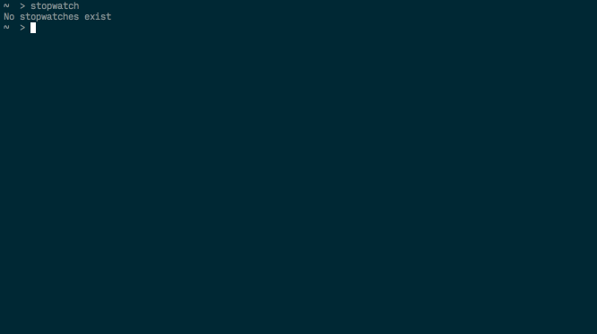

# stopwatch

Stopwatch is a very simple command line stopwatch.  It allows tracking many
different labeled timers.  The stopwatches are stored in your home directory
as `.stopwatch.json`.

Install

    go get github.com/jweir/stopwatch

Usage

    stopwatch          # list all running stopwatches
    stopwatch <label>  # stops an existing stopwatch, otherwise starts a new one
                       # label is the remainder of the line, i.e. it can include spaces
    stopwatch -stopall # stops all existing stopwatches

This was a quick 45 minute project to build a simple stop watch and scratch
that itch.

### TODO

* Add a help feature
* Version
* Clean the code up
* DONE

## LICENSE

The MIT License (MIT)
Copyright (c) 2016 John Weir

Permission is hereby granted, free of charge, to any person obtaining a copy of
this software and associated documentation files (the "Software"), to deal in
the Software without restriction, including without limitation the rights to
use, copy, modify, merge, publish, distribute, sublicense, and/or sell copies
of the Software, and to permit persons to whom the Software is furnished to do
so, subject to the following conditions:

The above copyright notice and this permission notice shall be included in all
copies or substantial portions of the Software.

THE SOFTWARE IS PROVIDED "AS IS", WITHOUT WARRANTY OF ANY KIND, EXPRESS OR
IMPLIED, INCLUDING BUT NOT LIMITED TO THE WARRANTIES OF MERCHANTABILITY,
FITNESS FOR A PARTICULAR PURPOSE AND NONINFRINGEMENT. IN NO EVENT SHALL THE
AUTHORS OR COPYRIGHT HOLDERS BE LIABLE FOR ANY CLAIM, DAMAGES OR OTHER
LIABILITY, WHETHER IN AN ACTION OF CONTRACT, TORT OR OTHERWISE, ARISING FROM,
OUT OF OR IN CONNECTION WITH THE SOFTWARE OR THE USE OR OTHER DEALINGS IN THE
SOFTWARE.
